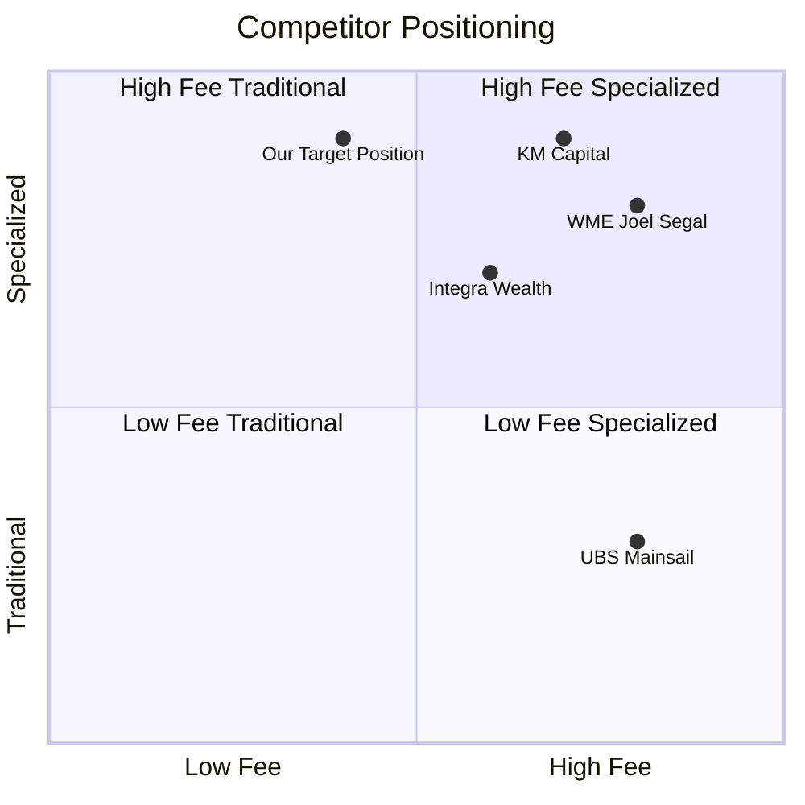
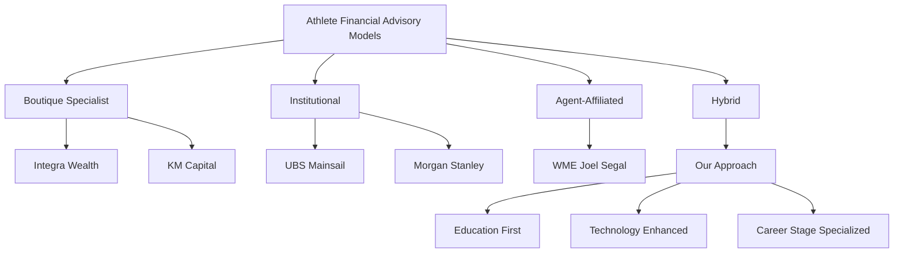

---

---

# Map of Content: Competitor Landscape

## Overview

This Map of Content provides a comprehensive overview of all competitor analysis resources within the Athlete Financial Empowerment project. It organizes competitive intelligence to help identify market gaps, differentiation opportunities, and strategic positioning.

## Key Resources

### Core Documents
- [[/Athlete Financial Empowerment/04-analysis/competitor-analysis/_index|Competitor Analysis Hub]]
- [[/Athlete Financial Empowerment/04-analysis/competitor-analysis/agent-advisor-models|Agent-Advisor Models]]
- [[/Athlete Financial Empowerment/04-analysis/competitor-positioning-diagram|Competitor Positioning Visual Analysis]]
- [[/Athlete Financial Empowerment/01-market-research/key-insights|Market Research Key Insights]]
- [[/Dashboards/project-progress|Project Progress Dashboard]]

### Key Competitors
- [[/Athlete Financial Empowerment/01-market-research/competitor-profiles/advisors/integra-wealth-management|Integra Private Wealth Management]]
- [[/Athlete Financial Empowerment/01-market-research/competitor-profiles/advisors/ubs-mainsail|UBS Mainsail]]
- [[/Athlete Financial Empowerment/01-market-research/competitor-profiles/advisors/km-capital-management|KM Capital Management]]
- [[/Athlete Financial Empowerment/01-market-research/competitor-profiles/advisors/wme-joel-segal|WME Joel Segal]]
- [[/Athlete Financial Empowerment/01-market-research/competitor-profiles/agents/kevin-conner|Kevin Conner (Agent)]]

## Content by Category

### Competitor Types

#### Wealth Management Firms
- [[/Athlete Financial Empowerment/01-market-research/competitor-profiles/advisors/integra-wealth-management|Integra Private Wealth Management]]
- [[/Athlete Financial Empowerment/01-market-research/competitor-profiles/advisors/ubs-mainsail|UBS Mainsail]]
- [[/Athlete Financial Empowerment/01-market-research/competitor-profiles/advisors/km-capital-management|KM Capital Management]]

#### Agent-Affiliated Services
- [[/Athlete Financial Empowerment/01-market-research/competitor-profiles/advisors/wme-joel-segal|WME Joel Segal]]
- [[/Athlete Financial Empowerment/04-analysis/competitor-analysis/agent-advisor-models|Agent-Advisor Models]]

#### Sports Agents
- [[/Athlete Financial Empowerment/01-market-research/competitor-profiles/agents/kevin-conner|Kevin Conner (Universal)]]
- [[/Athlete Financial Empowerment/02-interviews/industry-professionals/2025/04_april/2025-04-06_lynn-nicole_klutch_agent|Nicole Lynn (Klutch)]]
- [[/Athlete Financial Empowerment/02-interviews/industry-professionals/2025/04_april/2025-04-06_cabott-chris_steinberg_agent|Chris Cabott (Steinberg)]]
- [[/Athlete Financial Empowerment/02-interviews/industry-professionals/2025/04_april/2025-04-06_conner-kevin_universal_agent|Kevin Conner (Universal)]]

### Analysis Perspectives

#### Service Models
- [[/Athlete Financial Empowerment/04-analysis/competitor-analysis/boutique-firms/_index|Boutique Advisory Firms]]
- [[/Athlete Financial Empowerment/04-analysis/competitor-analysis/institutional-firms/_index|Institutional Firms]]

#### Market Positioning
- [[/Athlete Financial Empowerment/03-strategy/competitive-positioning|Competitive Positioning Strategy]]
- [[/Dashboards/competitor-analysis|Competitor Analysis Dashboard]]

#### Athlete Perspectives
- [[/Athlete Financial Empowerment/02-interviews/players/active/2025/04_april/2025-04-06_smith-roquan_ravens_linebacker|Roquan Smith - Advisor Selection]]
- [[/Athlete Financial Empowerment/02-interviews/players/active/2025/04_april/2025-04-06_jenkins-john_raiders_defensive-tackle|John Jenkins - Negative Advisor Experience]]
- [[/Athlete Financial Empowerment/02-interviews/players/former/2025/04_april/2025-04-06_harris-chris_broncos_cornerback|Chris Harris - Post-Career Perspective]]

## Visualizations

### Competitor Positioning Map



### Competitor Service Model Comparison



## Related Queries

### Recent Competitor Updates

```dataview
TABLE file.mtime as "Last Modified"
FROM "Athlete Financial Empowerment/01-market-research/competitor-profiles"
SORT file.mtime DESC
LIMIT 5
```

### All Competitor Profiles

```dataview
TABLE
  file.folder as "Category",
  tags as "Tags"
FROM "Athlete Financial Empowerment/01-market-research/competitor-profiles"
WHERE file.name != "_index"
SORT file.folder ASC
```

## Market Gap Analysis

Based on our competitor research, we've identified these key market gaps:

1. **Education-First Approach**: Most competitors focus on management rather than education
2. **Technology Integration**: Limited mobile-friendly dashboards and apps for athletes
3. **Transparent Fee Structure**: Industry relies heavily on AUM-based models
4. **Career-Stage Specialization**: Limited tailoring of services to specific career stages

## Action Items

- [ ] Complete detailed analysis of KM Capital Management service offering
- [ ] Research emerging boutique firms specializing in NFL players
- [ ] Develop comparison matrix of fee structures
- [ ] Create detailed SWOT analysis for top 3 competitors
- [ ] Update competitive positioning based on latest athlete interviews

## Notes

*This Map of Content should be regularly updated to reflect new competitor research and analysis. Last refreshed: April 8, 2025.*
